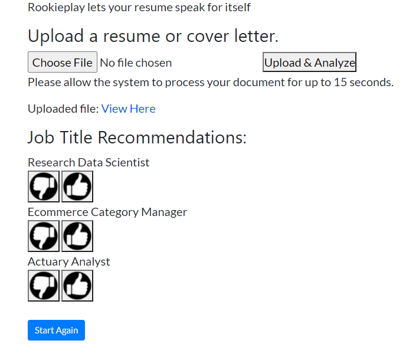

# Rookieplay Job Matchmaker

> Find job recommendations directly through content similarity

Rookieplay is a job recommendation engine that analyzes resume / cover letter data , compares it to job descriptions in order to find the closest company and job title match. You may find a matching job title that you hadn't considered before!

Deployed on Heroku for testing and initial proof of concept. 

> Current layout of application

## Status 

This is a *Work in Progress*! Development is ongoing, but you can check out the current live version at [http://rookieplay.herokuapp.com/](http://rookieplay.herokuapp.com/).
